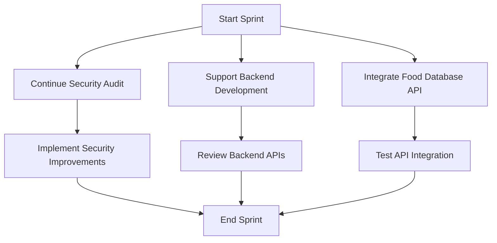

Certainly! I'll compile a personalized summary for Alex Rodriguez based on the information provided and using the template. Here's the personalized summary:

# Personalized Meeting Summary for Alex Rodriguez

## Sprint Overview
**Sprint Goal:** Implement core features for activity tracking and basic health metrics dashboard
**Sprint Duration:** 2024-06-24 to 2024-07-07

## Your Key Responsibilities
1. Lead technical decisions and architecture design
2. Mentor junior developers
3. Implement complex features across the stack
4. Code review and quality assurance
5. Conduct and support security-related tasks

## Your Assigned Tasks
1. **Continue Security Audit**
   - Description: Conduct a comprehensive security audit of the existing codebase
   - Priority: High
   - Estimated Effort: Ongoing throughout the sprint
   - Dependencies: None

2. **Support Backend Development**
   - Description: Provide guidance and assistance to Michael on backend API development
   - Priority: Medium
   - Estimated Effort: As needed
   - Dependencies: Backend API development tasks

3. **Integrate Basic Food Database API**
   - Description: Research and integrate a basic food database API for the nutrition logging feature
   - Priority: Medium
   - Estimated Effort: 3 story points
   - Dependencies: Backend API for storing nutrition data

## Your Task Flow Diagram

## Important Dates
- 2024-06-24: Sprint Start
- 2024-06-28: Mid-sprint review
- 2024-07-07: Sprint Review and Retrospective

## Your Contribution to Sprint Goals
Your work on the security audit is crucial for ensuring the overall safety and reliability of our application. While your capacity is reduced due to this important task, your support in backend development and the integration of the food database API directly contributes to the core features we're implementing this sprint. Your expertise will be invaluable in making sound technical decisions and maintaining code quality across the project.

## Collaboration Points
- Michael: Collaborate on backend API development and security considerations
- Emily: Provide guidance on frontend-backend integration, especially for the nutrition logging feature
- Olivia: Coordinate on security aspects that may impact testing and deployment

## Notes and Additional Information
- Your capacity is reduced to 8 story points this sprint due to the ongoing security audit. We've adjusted task assignments accordingly.
- Please prioritize critical security findings that may impact the new features being developed this sprint.
- Your mentorship will be crucial for guiding the team through any technical challenges, especially in API design and integration.

## Questions or Concerns?
If you have any questions or concerns about your tasks or the sprint in general, please don't hesitate to reach out to Sarah (Scrum Master) or the Product Owner.