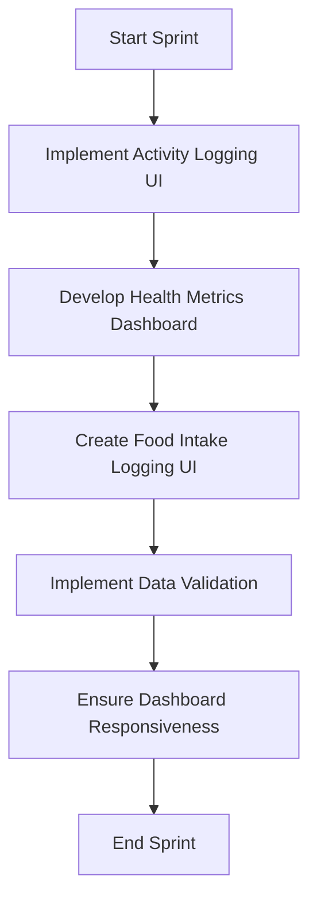

Based on the provided information, I'll create a personalized summary for Emily Watson using the template.

# Personalized Meeting Summary for Emily Watson

## Sprint Overview
**Sprint Goal:** Implement core features for activity tracking and basic health metrics dashboard
**Sprint Duration:** 2024-06-24 to 2024-07-07

## Your Key Responsibilities
1. Implement responsive and intuitive user interfaces
2. Collaborate with UI/UX designer to bring designs to life
3. Optimize frontend performance
4. Ensure cross-browser compatibility

## Your Assigned Tasks
1. **Implement Frontend for Activity Logging**
   - Description: Create UI components for users to manually log daily activities
   - Priority: High
   - Estimated Effort: 5 story points
   - Dependencies: Dashboard layout design from Liam

2. **Develop Health Metrics Dashboard Frontend**
   - Description: Implement frontend components for displaying health metrics
   - Priority: High
   - Estimated Effort: 5 story points
   - Dependencies: Backend API for aggregating health data

3. **Create UI for Food Intake Logging**
   - Description: Develop frontend interface for users to log daily food intake
   - Priority: Medium
   - Estimated Effort: 4 story points
   - Dependencies: Backend API for storing nutrition data

4. **Implement Data Validation for Activity Logging**
   - Description: Ensure proper data validation on the frontend for activity logging
   - Priority: High
   - Estimated Effort: 2 story points
   - Dependencies: None

5. **Implement Responsiveness for Dashboard**
   - Description: Ensure the dashboard is fully responsive across all devices
   - Priority: Medium
   - Estimated Effort: 3 story points
   - Dependencies: Completion of dashboard layout

## Your Task Flow Diagram

## Important Dates
- 2024-06-24: Sprint Start
- 2024-06-25: Begin frontend components for activity logging
- 2024-06-28: Complete data validation implementation
- 2024-07-03: Finish dashboard responsiveness
- 2024-07-07: Sprint Review and Retrospective

## Your Contribution to Sprint Goals
Your tasks are crucial for achieving the sprint goal of implementing core features for activity tracking and the basic health metrics dashboard. Your work on the frontend components will directly enable users to log their activities, view their health metrics, and input their nutrition data. Your focus on responsive design and data validation will ensure a high-quality user experience, which is essential for the success of these new features.

## Collaboration Points
- Liam (UI/UX Designer): Collaborate on dashboard layout and UI components
- Michael (Backend Developer): Coordinate on API integration for activity, health metrics, and nutrition data
- Olivia (QA Engineer): Work together on frontend testing and ensuring cross-browser compatibility
- Alex (Senior Full-Stack Developer): Consult on any complex frontend implementations or performance optimizations

## Notes and Additional Information
- Remember to utilize your expertise in React.js and TypeScript for all frontend development
- Pay special attention to the responsiveness of the dashboard, as it's a key feature for user satisfaction
- Consider using a UI component library to speed up development, but ensure it aligns with the existing design system
- Keep performance in mind, especially when implementing data visualizations for activity trends and health metrics

## Questions or Concerns?
If you have any questions or concerns about your tasks or the sprint in general, please don't hesitate to reach out to Sarah (Scrum Master) or the Product Owner.