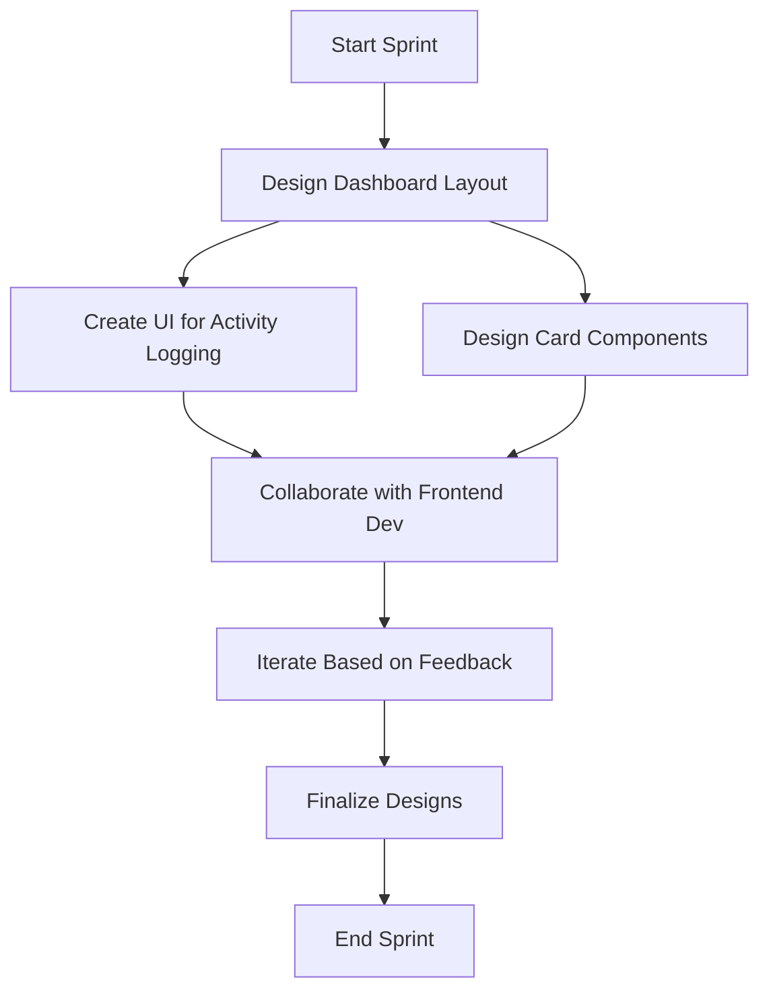

Based on the provided information, I'll create a personalized summary for Liam Foster using the given template.

# Personalized Meeting Summary for Liam Foster

## Sprint Overview
**Sprint Goal:** Implement core features for activity tracking and basic health metrics dashboard
**Sprint Duration:** 2024-06-24 to 2024-07-07

## Your Key Responsibilities
1. Create user-centric designs and prototypes
2. Develop and maintain the design system
3. Collaborate with developers to ensure design integrity

## Your Assigned Tasks
1. **Design dashboard layout and new UI components**
   - Description: Create the overall layout for the health metrics dashboard and design new UI components as needed
   - Priority: High
   - Estimated Effort: 5 story points
   - Dependencies: None

2. **Design UI for activity logging form**
   - Description: Create a user-friendly interface for manual activity logging
   - Priority: High
   - Estimated Effort: Part of the 5 story points for frontend UI for activity logging
   - Dependencies: None

3. **Create reusable card components for dashboard widgets**
   - Description: Design reusable card components to display various health metrics on the dashboard
   - Priority: High
   - Estimated Effort: Part of the 5 story points for dashboard layout implementation
   - Dependencies: Dashboard layout design

## Your Task Flow Diagram

## Important Dates
- 2024-06-24: Sprint Start
- 2024-06-26: Start designing dashboard layout and new UI components
- 2024-07-01: Mid-sprint review (estimated)
- 2024-07-07: Sprint Review and Retrospective

## Your Contribution to Sprint Goals
Your designs for the dashboard layout, activity logging UI, and reusable card components are crucial for achieving the sprint goal of implementing core features for activity tracking and the basic health metrics dashboard. Your work will directly impact the user experience and set the foundation for the frontend development.

## Collaboration Points
- Emily (Frontend Developer): Collaborate on UI implementation and ensure design integrity
- Michael (Backend Developer): Align on data structure for dashboard and activity logging to ensure proper data visualization
- Olivia (QA Engineer): Discuss usability aspects and potential testing scenarios for the new UI components

## Notes and Additional Information
- Focus on creating a responsive design that works well on various device sizes
- Consider accessibility standards while designing the UI components
- Utilize the existing design system and create new components as needed
- Your expertise in interaction design will be crucial for creating an intuitive activity logging process

## Questions or Concerns?
If you have any questions or concerns about your tasks or the sprint in general, please don't hesitate to reach out to Sarah (Scrum Master) or the Product Owner.