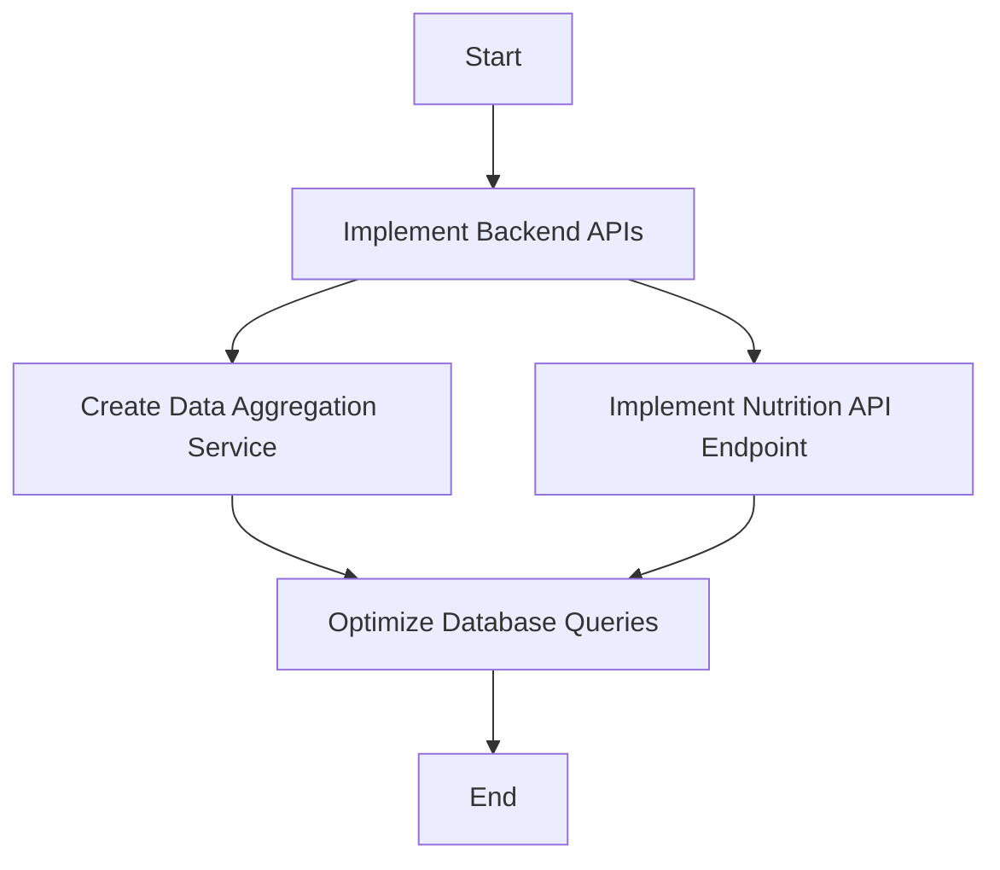

Based on the provided information and context, I'll create a personalized summary for Michael Kim using the given template.

# Personalized Meeting Summary for Michael Kim

## Sprint Overview
**Sprint Goal:** Implement core features for activity tracking and basic health metrics dashboard
**Sprint Duration:** 2024-06-24 to 2024-07-07

## Your Key Responsibilities
1. Develop and maintain server-side logic
2. Design and implement database schemas
3. Create and document APIs
4. Implement data processing and analysis features

## Your Assigned Tasks
1. **Implement Backend APIs for Activity and Health Data**
   - Description: Create RESTful APIs for storing and retrieving activity and health metric data
   - Priority: High
   - Estimated Effort: 7 story points
   - Dependencies: None

2. **Create Data Aggregation Service for Health Metrics**
   - Description: Develop a service to aggregate health data for the dashboard
   - Priority: High
   - Estimated Effort: 4 story points
   - Dependencies: Backend APIs for health data

3. **Implement API Endpoint for Nutrition Data**
   - Description: Create an API endpoint for saving and retrieving nutrition data
   - Priority: Medium
   - Estimated Effort: 3 story points
   - Dependencies: None

4. **Optimize Database Queries**
   - Description: Analyze and optimize database queries for improved performance
   - Priority: Medium
   - Estimated Effort: 2 story points (part of buffer)
   - Dependencies: None

## Your Task Flow Diagram

## Important Dates
- 2024-06-25: Begin implementing backend APIs
- 2024-07-01: Start data aggregation for health metrics dashboard
- 2024-07-05: Conduct performance testing on APIs with Olivia
- 2024-07-07: Sprint Review and Retrospective

## Your Contribution to Sprint Goals
Your tasks are crucial for the success of this sprint. By implementing the backend APIs and data aggregation service, you're providing the foundation for the activity tracking and health metrics dashboard features. Your work on the nutrition API endpoint will also support the basic food intake logging feature. Your expertise in database optimization will ensure the system performs well as we add these new features.

## Collaboration Points
- Emily: Coordinate on API design for frontend integration
- Olivia: Work together on performance testing of APIs
- Alex: Consult on security best practices for API implementation
- Liam: Discuss data requirements for dashboard visualization

## Notes and Additional Information
- Remember to implement data validation on the backend to ensure data accuracy
- Consider caching strategies when implementing the data aggregation service to improve performance
- Keep documentation up-to-date for all new APIs created

## Questions or Concerns?
If you have any questions or concerns about your tasks or the sprint in general, please don't hesitate to reach out to Sarah (Scrum Master) or the Product Owner.