Based on the provided information, I'll create a personalized summary for Olivia Martinez using the given template.

# Personalized Meeting Summary for Olivia Martinez

## Sprint Overview
**Sprint Goal:** Implement core features for activity tracking and basic health metrics dashboard
**Sprint Duration:** 2024-06-24 to 2024-07-07

## Your Key Responsibilities
1. Develop and execute test plans and test cases
2. Set up and maintain CI/CD pipelines
3. Manage deployment processes and infrastructure
4. Monitor system performance and security

## Your Assigned Tasks
1. **Set up test plans for new features**
   - Description: Develop comprehensive test plan for new features including activity tracking, health metrics dashboard, and basic nutrition logging
   - Priority: High
   - Estimated Effort: 2 story points
   - Dependencies: Initial implementation of frontend and backend components

2. **Perform manual testing of UI/UX**
   - Description: Conduct manual testing of user interface and user experience for all new features
   - Priority: High
   - Estimated Effort: 1 story point
   - Dependencies: Completion of frontend components

3. **Create automated test scripts**
   - Description: Develop automated test scripts for critical user journeys using Selenium or Cypress
   - Priority: Medium
   - Estimated Effort: 2 story points
   - Dependencies: Completion of core feature implementations

4. **Conduct performance testing on APIs**
   - Description: Perform performance testing on new API endpoints for activity tracking, health metrics, and nutrition logging
   - Priority: Medium
   - Estimated Effort: 1 story point
   - Dependencies: Completion of backend API implementations

5. **Set up end-to-end testing environment**
   - Description: Configure and set up an environment for comprehensive end-to-end testing of the HealthTrack Pro application
   - Priority: Medium
   - Estimated Effort: 2 story points
   - Dependencies: None

## Your Task Flow Diagram

```mermaid
graph TD
    A[Set up test plans] --> B[Perform manual testing]
    A --> C[Create automated test scripts]
    B --> D[Conduct performance testing on APIs]
    C --> D
    A --> E[Set up end-to-end testing environment]
```

## Important Dates
- 2024-06-26: Start setting up test plans for new features
- 2024-07-05: Conduct performance testing on APIs
- 2024-07-07: Sprint Review and Retrospective

## Your Contribution to Sprint Goals
Your QA and DevOps expertise is crucial for ensuring the quality and reliability of the core features being implemented this sprint. By setting up comprehensive test plans, performing thorough manual and automated testing, and conducting performance tests, you'll help guarantee that the activity tracking and health metrics dashboard meet our quality standards. Your work on the end-to-end testing environment will also set the foundation for ongoing quality assurance as we continue to develop HealthTrack Pro.

## Collaboration Points
- Emily: Coordinate on frontend testing requirements and UI/UX validation
- Michael: Collaborate on API testing and performance optimization
- Alex: Consult on security testing aspects, especially related to the ongoing security audit
- Liam: Discuss UI/UX testing criteria for new design components

## Notes and Additional Information
- Given your dual role as QA Engineer and DevOps Specialist, please allocate your time effectively between testing tasks and maintaining our CI/CD pipeline.
- Keep an eye on the performance of our deployment processes as we add new features.
- If you identify any security concerns during testing, please flag them immediately, considering Alex's ongoing security audit.

## Questions or Concerns?
If you have any questions or concerns about your tasks or the sprint in general, please don't hesitate to reach out to Sarah (Scrum Master) or the Product Owner.