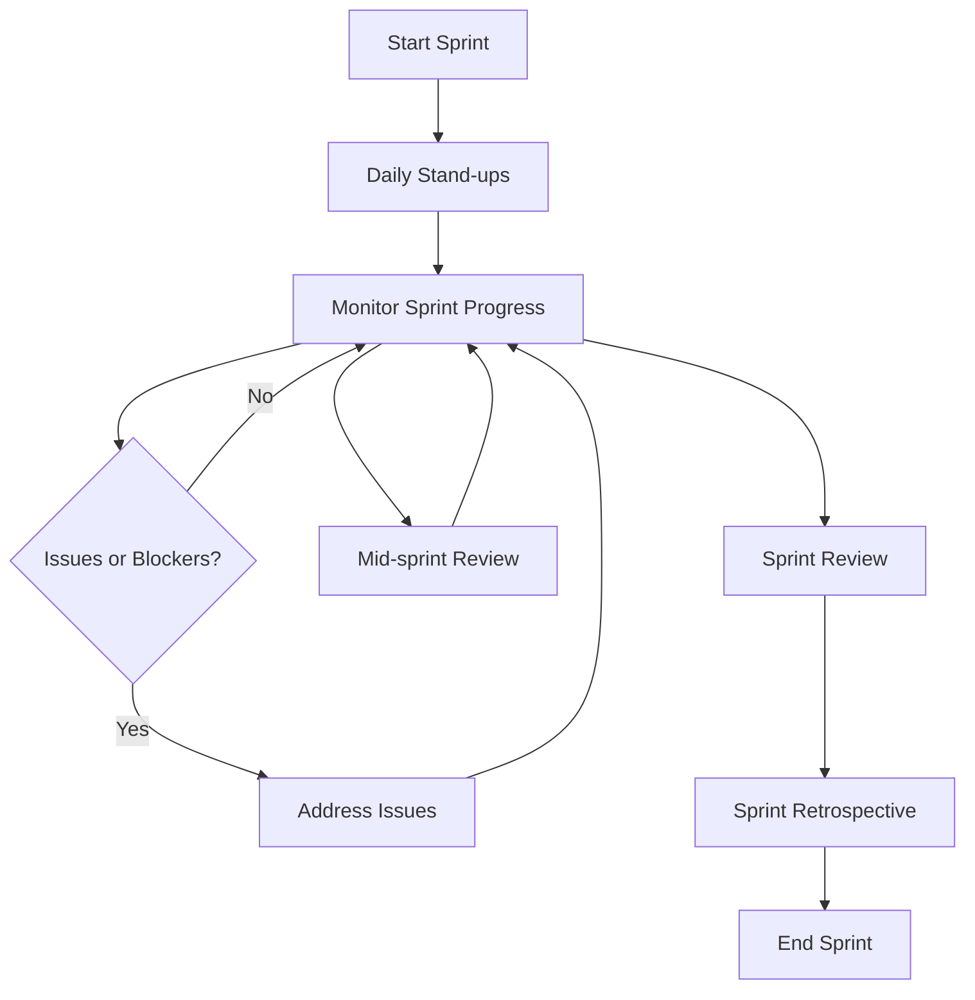

Based on the provided information, I'll create a personalized summary for Sarah Chen, who is the Project Manager / Scrum Master for the HealthTrack Pro project. Here's the personalized summary:

# Personalized Meeting Summary for Sarah Chen

## Sprint Overview
**Sprint Goal:** Implement core features for activity tracking and basic health metrics dashboard
**Sprint Duration:** 2024-06-24 to 2024-07-07

## Your Key Responsibilities
1. Oversee project progress and timelines
2. Facilitate communication between team members and stakeholders
3. Conduct sprint planning, daily stand-ups, and retrospectives
4. Manage project risks and resources

## Your Assigned Tasks
1. **Facilitate Daily Stand-ups**
   - Description: Conduct daily stand-up meetings at 9:30 AM
   - Priority: High
   - Estimated Effort: 15 minutes per day
   - Dependencies: Team member availability

2. **Mid-sprint Review**
   - Description: Organize and lead the mid-sprint review
   - Priority: Medium
   - Estimated Effort: 2 hours
   - Dependencies: Team progress on sprint tasks

3. **Sprint Review and Retrospective**
   - Description: Prepare for and facilitate sprint review and retrospective
   - Priority: High
   - Estimated Effort: 3 hours
   - Dependencies: Completion of sprint tasks

4. **Monitor Sprint Progress**
   - Description: Track progress, update sprint board, and manage any blockers
   - Priority: High
   - Estimated Effort: Ongoing throughout the sprint
   - Dependencies: Regular updates from team members

5. **Stakeholder Communication**
   - Description: Keep stakeholders informed about sprint progress and any significant developments
   - Priority: Medium
   - Estimated Effort: 2 hours per week
   - Dependencies: Sprint progress and any major decisions or issues

## Your Task Flow Diagram

## Important Dates
- 2024-06-24: Sprint Start
- 2024-07-01: Mid-sprint Review (tentative)
- 2024-07-07: Sprint Review at 2:00 PM
- 2024-07-07: Sprint Retrospective at 3:30 PM

## Your Contribution to Sprint Goals
As the Scrum Master, your role is crucial in ensuring the team achieves the sprint goal of implementing core features for activity tracking and basic health metrics dashboard. Your facilitation of daily stand-ups, management of project risks, and ongoing communication will keep the team aligned and focused on delivering the key features within the sprint timeframe.

## Collaboration Points
- Alex: Monitor impact of security audit on sprint tasks and help redistribute work if necessary
- Emily & Michael: Ensure smooth collaboration between frontend and backend development
- Olivia: Coordinate on QA efforts and test plan implementation
- Liam: Facilitate design input and approval for new UI components

## Notes and Additional Information
- Be prepared to adjust the sprint plan if Alex's reduced capacity due to the security audit impacts progress
- Pay special attention to the implementation of data validation and performance optimization, as these were identified as key risks
- Consider organizing a brief session with Emily and Michael to review the simplified food database integration for the nutrition logging feature

## Questions or Concerns?
If you have any questions or concerns about your tasks or the sprint in general, please don't hesitate to reach out to the Product Owner or escalate to senior management if necessary.