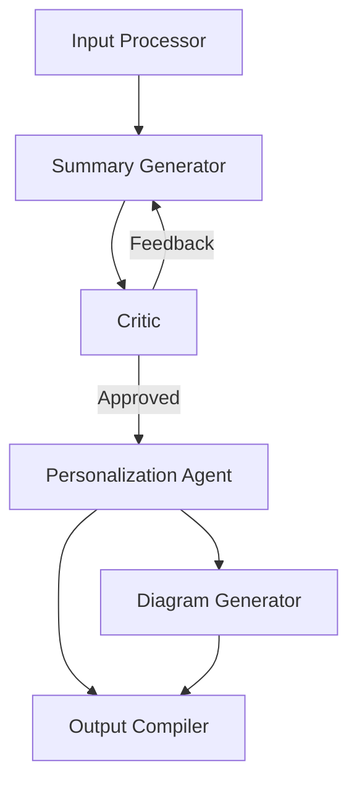

# LangGraph Pipeline Design for Meeting Transcript Processing

## Overview

The pipeline will process meeting transcripts to generate personalized summaries and relevant outputs. It will use a graph structure where each node represents an agent or a process, and edges represent the flow of information.

## Node Types

1. Input Processor
2. Summary Generator
3. Critic
4. Personalization Agent
5. Diagram Generator
6. Output Compiler

## Graph Structure



## Detailed Node Descriptions

### 1. Input Processor
- **Purpose**: Preprocess the raw transcript and gather contextual information
- **Inputs**: 
  - Raw meeting transcript
  - Company information
  - Project details
  - Employee profiles
  - Meeting type
- **Outputs**: 
  - Cleaned transcript
  - Relevant context dictionary

### 2. Summary Generator
- **Purpose**: Create a comprehensive meeting summary
- **Inputs**: 
  - Cleaned transcript
  - Relevant context
- **Outputs**: 
  - Structured meeting summary

### 3. Critic
- **Purpose**: Evaluate and improve the summary
- **Inputs**: 
  - Generated summary
  - Original inputs (for reference)
- **Outputs**: 
  - Feedback for improvement
  - Approval flag

### 4. Personalization Agent
- **Purpose**: Tailor the summary for individual employees
- **Inputs**: 
  - Approved summary
  - Employee profiles
- **Outputs**: 
  - Personalized summaries for each employee

### 5. Diagram Generator
- **Purpose**: Create relevant visualizations
- **Inputs**: 
  - Approved summary
  - Meeting type
- **Outputs**: 
  - Generated diagrams (e.g., Mermaid syntax)

### 6. Output Compiler
- **Purpose**: Compile final personalized reports
- **Inputs**: 
  - Personalized summaries
  - Generated diagrams
- **Outputs**: 
  - Final personalized reports (e.g., Markdown or HTML)

## Implementation Details

1. **State**: 
   - Use a shared state object to pass information between nodes
   - State will include: original inputs, processed data, generated summaries, feedback, personalized content, and diagrams

2. **Edges**:
   - Define edges with conditions (e.g., Critic to Summary Generator edge only if improvements needed)
   - Use LangGraph's conditional edges to control flow based on output flags

3. **Agents**:
   - Implement each node as a LangChain agent with a specific prompt and set of tools
   - Use LangChain's memory components to maintain context across iterations

4. **Tools**:
   - Provide agents with relevant tools:
     - Text processing tools for Input Processor
     - NLP tools for Summary Generator and Personalization Agent
     - Mermaid diagram generation tool for Diagram Generator

5. **Human-in-the-Loop**:
   - Implement an optional human review step after the Critic node
   - Use LangGraph's human-in-the-loop capabilities to allow manual approval or editing

## Example LangGraph Code Structure

```python
from langchain.graphs import StateGraph
from langchain.agents import Agent
from langchain.tools import Tool

# Define agents
input_processor = Agent(...)
summary_generator = Agent(...)
critic = Agent(...)
personalization_agent = Agent(...)
diagram_generator = Agent(...)
output_compiler = Agent(...)

# Create graph
workflow = StateGraph(agents=[
    input_processor,
    summary_generator,
    critic,
    personalization_agent,
    diagram_generator,
    output_compiler
])

# Define edges
workflow.add_edge(input_processor, summary_generator)
workflow.add_conditional_edge(
    summary_generator,
    critic,
    condition=lambda x: not x["summary_approved"]
)
workflow.add_conditional_edge(
    critic,
    summary_generator,
    condition=lambda x: x["needs_revision"]
)
workflow.add_edge(critic, personalization_agent)
workflow.add_edge(personalization_agent, diagram_generator)
workflow.add_edge(personalization_agent, output_compiler)
workflow.add_edge(diagram_generator, output_compiler)

# Set up entry point
workflow.set_entry_point(input_processor)

# Run the workflow
final_output = workflow.run(initial_input={
    "transcript": "...",
    "company_info": "...",
    "project_details": "...",
    "employee_profiles": "...",
    "meeting_type": "..."
})
```

This LangGraph structure allows for a flexible, modular approach to processing meeting transcripts. It enables iterative improvement of the summary through the critic feedback loop and allows for easy extension or modification of the pipeline by adding or changing nodes and edges.
