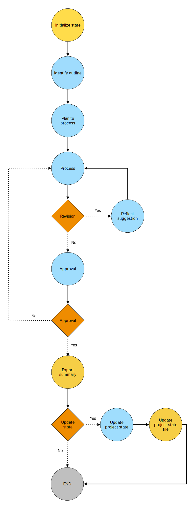

1. Introduction
2. Related work
   2.1 Large Language models 
   2.2 Transcript systems 
   2.3 Agentic workflow 
   2.4 Meeting analysis  
   2.5 Scrum  
3. Methodology 
   3.1 General architecture  
   3.2 System elements  
   3.3 Workflows  
4. Result demonstration through use case 
    4.1 Example
    4.2 Test data generation
    4.3 Human like behaviour?
5. Conclusion / Discussion (entrpia), gondolat kisérlet lehete? 
6. References

# 1. Introduction


In the wake of the global shift towards remote and hybrid work models, digital meetings have become the backbone of modern business communication. Platforms like Microsoft Teams generate vast amounts of unprocessed meeting transcript data daily, presenting both an opportunity and a challenge for organizations striving to maximize productivity and information flow. These digital often result in information overload, with critical insights lost in verbose conversations and unstructured notes.

This thesis addresses the pressing need for efficient information processing in digital workplaces by proposing a novel multi-agent system for analyzing meeting transcripts. The challenge lies not just in summarizing conversations, but in distilling key insights, aligning them with individual roles and responsibilities, and transforming them into actionable outcomes. Traditional approaches to meeting documentation often fall short, failing to capture the nuanced context and personalized relevance that drive effective team collaboration and project management.

Recent advancements in Large Language Models (LLMs) and speech-to-text technologies, have set the stage for innovative solutions to this challenge. LLMs demonstrate unprecedented capabilities in natural language understanding and generation, while improved speech recognition systems provide highly accurate meeting transcripts. These technological enablers form the foundation of the proposed system, allowing for sophisticated analysis and interpretation of meeting content.

At the heart of this research is a multi-agent system designed to transform raw meeting transcripts into tailored, actionable insights. The system employs a two-stage architecture implemented using LangGraph and LangChain. The first stage features a General Summary component that utilizes agentic patterns such as planning and reflection to create and refine comprehensive meeting summaries. The second stage focuses on meeting-specific workflows, adapting outputs based on meeting types such as sprint planning, daily stand-ups, and retrospectives in Scrum environments. A human-in-the-loop approach between these stages ensures accuracy and builds trust in the AI-generated content.

The novelty of our approach lies in its use of multiple collaborative agents, each specialized in different aspects of information processing. By incorporating context-aware summarization and information compression techniques, the system can distill key points and personalize them to each participant's role. This multi-agent workflow allows for more complex and accurate summaries than single-agent systems, while the integration of company and project-specific context enables more relevant and impactful outputs.

This thesis aims to contribute to the evolving landscape of AI-assisted collaboration tools by:
1. Developing and evaluating a robust, multi-agent system for processing meeting transcripts and generating actionable insights.
2. Exploring the effectiveness of context-aware and personalized information compression in enhancing meeting productivity and knowledge dissemination.
3. Investigating the implications of this technology for project management and team collaboration, particularly within agile software development frameworks.

The subsequent chapters will delve into the technical details of the system architecture, the challenges encountered during development, and the results of performance and user impact studies. By addressing the growing challenge of information overload in digital meetings, this research demonstrates how thoughtfully designed AI systems can enhance human capabilities, improve organizational efficiency, and unlock new value from our daily professional interactions.


# 2. Background
## 2.1 Large Language Models
- llm capabilaties
- cost
- size
- benchmarks
- context window
## 2.2 Speech to text
## 2.3 Agentic workflow
- fully autonomous - router
- control - reliability
- stateGraph

## 2.4 Meeting analysis - Existing solutions
- zoom / meet/ teams 
## 2.5 Scrum
- why it is good structure
- meeting típusok
- van egy struktúrája lehet ra mehatzározott lépéseket definiálni - more reliability
# 3. LLM driven system for Meeting summary  
## 3.1 General architecture  

In developing an LLM-driven system for meeting transcript analysis, I adopted an approach that balances structure and flexibility. This balance is crucial in a business context where reliability and predictability are paramount, yet the power of Large Language Models (LLMs) to handle complex, context-dependent tasks must be leveraged.

The architecture of my system is built on the concept of **guided workflows**. These workflows provide a framework of well-defined steps, offering a clear path for the LLM to follow.  However, recognizing that not every scenario can be anticipated, I incorporated flexibility at key points. This allows the agent to define next steps or create plans based on variable conditions. 

This approach emerged from my extensive experimentation with various architectures. The current structure, consisting of interconnected, largely defined steps (each involving an LLM call or tool use), has proven most effective in producing quality solutions. It strikes a balance between providing clear direction and allowing for adaptive planning.

A key feature of our architecture is its context-awareness. The system processes meeting transcripts not in isolation, but with consideration of broader project status, company information, and individual roles. This contextual processing is crucial for accurate interpretation and meaningful output generation. The system consists of multiple workflows covering the entire process from **meeting transcript analysis** to **personalized summary creation**. 

In designing this architecture, I carefully considered several critical factors. Foremost among these was the need to **minimize hallucination and information loss**, which are common challenges when working with LLMs. I also focused on leveraging proven techniques for optimal results, always mindful of the capabilities and limitations of LLMs. Another crucial aspect was the incorporation of human oversight at key junctures, allowing for correction and refinement of the system's output. Additionally, I ensured the architecture was scalable and adaptable to different meeting types and organizational structures, making it versatile for various business contexts.


In the following sections, we will delve deeper into the specific components of this system, exploring how each contributes to the overall goal of transforming raw meeting transcripts into actionable, personalized insights.

## 3.2 System elements  


The system comprises several interconnected components, each playing a crucial role in the overall workflow. At its core, the system is divided into three main stages: **Transcript Generation**, **General Summary**, and **Meeting-Specific Processing**.

The foundation of the system's effectiveness lies in its utilization of context data. This includes **static information** such as company details, project descriptions, and employee profiles, as well as **variable data** reflecting the current project status, backlog, and past meeting records. By incorporating this rich contextual information, the system achieves a "context-aware" processing capability, essential for accurate and relevant output generation.

The first stage, Transcript Generation, while not part of the actual meeting processing, plays a vital role in system development and testing. This component generates synthetic meeting data, simulating various Scrum meeting types. The need for this arose from the confidential nature of real-world meeting transcripts and the difficulty in accessing comprehensive context data. The specifics of this data generation process will be elaborated upon in chapter 5 of this thesis.

The second stage, General Summary, forms the cornerstone of the transcript processing workflow. Its primary function is to distill the often extensive meeting transcript into a manageable, information-rich format. This stage is crucial not only for reducing the computational load on subsequent processes but also for maintaining the quality of information extraction. Additionally, this stage updates the project status document based on the newly generated summary, ensuring that the system's context remains current for future processing tasks.

The third stage encompasses the Meeting-Specific workflows, tailored to handle the three primary Scrum meeting types: Sprint Planning, Daily Stand-up, and Sprint Retrospective. Each of these workflows is designed to extract and present information in a manner most beneficial to the meeting's purpose and participants.

The Sprint Planning workflow produces personalized summaries for each participant, detailing their tasks for the upcoming sprint. It also generates a comprehensive breakdown of tasks into Epics, Stories, and individual Tasks, culminating in a proposed sprint backlog. This output can be directly integrated into project management tools like GitHub Issues, streamlining the planning process.

The Daily Stand-up workflow focuses on identifying new tasks mentioned during the meeting and updating the existing backlog accordingly. It generates concise, personalized summaries for each team member, often supplemented with relevant diagrams to aid in daily task organization.

Lastly, the Sprint Retrospective workflow creates a comprehensive summary of the sprint's progress. It provides individual performance summaries based on completed backlog items and compiles feedback to generate suggestions for improving future sprints.

Throughout these workflows, the system maintains a balance between automation and human oversight. Each stage allows for human verification and intervention, ensuring the accuracy and relevance of the generated outputs while leveraging the efficiency of LLM-driven processing.

This modular architecture not only allows for the effective processing of different meeting types but also provides the flexibility to adapt to specific organizational needs or to incorporate additional meeting types in the future.


Each workflow in our system follows a consistent structure, built using the LangGraph StateGraph framework. The basic structure of each workflow is as follows:

```python
class WorkflowState(TypeDict):
    # State variables

class AgenticWorkflow:
    def __init__(self, model):
        self.model = model
        self.state = WorkflowState()
        graph = StateGraph(WorkflowState)
        # Define LangGraph StateGraph
        # Add nodes, add edges or conditional edges
        # Add entrypoint
        self.graph = graph.compile()

    # Define node functions
    # Define conditional edge logic
    # Run function to invoke graph
```

This structure is replicated across the five distinct workflows in our system. Each of these workflows is essentially a LangGraph StateGraph, orchestrating the interconnection of various AI agents to process and analyze meeting transcripts.

The StateGraph framework provides a powerful abstraction for modeling complex AI workflows as graphs. It allows for the creation of dynamic, context-aware processes that evolve a shared state over time, making it ideal for our meeting analysis tasks. By using this consistent structure across all workflows, we ensure a modular and extensible system design, capable of handling various meeting types and analysis requirements.

In the following sections, we will deep dive into two key workflows: the General Summary workflow, which forms the backbone of the meeting analysis system, and the Daily Meeting workflow, which demonstrates how we handle a specific meeting type. While we focus on these two, it's important to note that all other workflows in the system follow a similar logic and structure.

## 3.3 Agentic workflows

The foundation of our General Summary workflow is the NoteTakerState, a comprehensive state object that encapsulates all necessary information for the meeting analysis process:

```python
class NoteTakerState(TypedDict):
    company_data: str                   # static context
    project_general: str                # static context  
    project_requirements: str           # static context
    employee_profiles: str              # static context

    meeting_history: Dict[str, Any]     # changing context
    project_state: str                  # changing context
    project_backlog: Dict[str, Any]     # changing context

    process_message_history: List[str]  # message history of Proccess agent
    transcript: str                     # meeting transcript

    meeting_outline: str                # node response
    process_plan: str                   # node response
    reflection: str                     # node response
    general_summary_draft: str          # node response
    reflect_plan: str                   # node response         
    approved: str                       # node response

    revision_number: int                # number of revisions
    max_revision: int                   # hyperparameter
    summary_final: str                  # finalized note
    need_update: bool                   # hyperparameter
```

This state object ensures that each node in our workflow has access to all relevant context, enabling truly context-aware processing throughout the analysis.

Workflow Structure:


Workflow Nodes and Their Functions:

Initialize State (Tool node):
This node sets up the state for the entire workflow. It loads crucial context variables such as company data, employee profiles, project state, requirements, and backlog, along with the meeting transcript that serves as the primary input. The remaining state variables are populated by subsequent graph elements as they execute. From here, the workflow always proceeds to the Identify Outline node.

The next two nodes, Identify Outline and Plan to Process, are crucial in preparing the prompt for the main Process node. This approach draws inspiration from techniques like back step prompting, planning, and chain of thought. By supplying the Process node with a comprehensive outline and plan, we enhance its ability to generate a more accurate and contextually relevant summary.

Identify Outline (Agent node): This node generates a meeting outline based on the provided context and meeting content. The output becomes a key component of the Process node's prompt, providing a clear roadmap for transcript analysis. This step, inspired by back step prompting, significantly enhances LLM performance by offering a structured overview before detailed processing begins. It's important to note that this node is stateless, meaning it doesn't retain information between calls. The workflow always proceeds to the Plan to Process node next.

Plan to Process (Agent node): 
Employing the planning agentic pattern, this stateless node crafts a processing strategy based on the meeting outline and contextual information. This approach allows for flexibility in handling various meeting types and content, addressing challenges that would be difficult to solve through traditional programming or static prompts. The output from this node becomes another crucial component of the Process node's prompt, further enhancing the system's ability to adapt to different meeting scenarios. By incorporating this planning step, we achieve a balance of robustness and flexibility across diverse meeting types. The workflow invariably moves to the Process node after this step.


Process (Agent node): 
This core node utilizes the outputs from the previous nodes, along with the transcript and context information, to generate a comprehensive meeting note. The processing is inherently context-aware, resulting in a draft summary that reflects the meeting's specific nuances. The node stores the "session" in a history list, allowing for potential refinements in subsequent steps. This design enables an interactive scenario where following nodes like Reflect Suggestion and Approval can prompt the Process node to make specific improvements or corrections, similar to how one might refine an AI chatbot's response. From here, the workflow can proceed to either the Reflect Suggestion node or the Approval node, depending on the current revision count and maximum allowed revisions.

Reflect Suggestion (Agent node): 
Implementing the reflection agentic pattern, this stateless node evaluates the draft summary and proposes improvements. Its output is appended to the process history, simulating a scenario where an independent entity reviews and refines the work. The frequency of this reflection is controlled by a hyperparameter, balancing the potential for improvement against computational cost. After this step, the workflow always returns to the Process node for refinement.

Approval (Agent node):
This verification node can either be an LLM-based check or replaced with a human-in-the-loop solution. It validates the note against the original transcript, ensuring accuracy and completeness. If issues are detected, the node provides detailed feedback, guiding the Process node to make specific corrections. This cycle continues until approval is granted. Upon approval, the workflow moves to the Export Summary node. If not approved, it returns to the Process node.

Export Summary (Tool node):
A straightforward function node that finalizes and exports the approved note. Depending on a hyperparameter setting, the workflow can either conclude here (moving to the END node) or proceed to the Update Project State node.

Update Project State (Agent node):
This node engages an LLM to update the project status based on the meeting outcomes, taking care not to overwrite existing sprint information. Once complete, it moves to the Update Project State File node.

Update Project State File (Tool node):
The final node in the workflow, it saves the updated project status and then directs control to the END node, concluding the workflow.


It's important to note that most nodes in this workflow are stateless, performing supplementary tasks without storing conversation history. These stateless agents, like the outline creation and planning steps, are crucial in preparing the right context and instructions for the main "Process" node. The reflection and approval steps, while also stateless, serve to evaluate and refine the output of the process node.

This design mirrors a scenario where multiple AI agents collaborate on a task, each specializing in a different aspect of the process. For instance, the reflection step is akin to having a separate AI review and suggest improvements on the work done by another. It's as if we're orchestrating a team of AI assistants, each with a specific role in the analysis process.

The system is designed to be modular and flexible, capable of handling different types of meetings. The general summaries produced by this workflow serve as valuable input for meeting-specific workflows, which are tailored to extract and present information in a manner most beneficial to each meeting's purpose and participants.

Importantly, the system allows for human intervention or override before finalizing the note. The approval node, for instance, could be replaced or supplemented with human oversight, ensuring a balance between automation and human judgment.

The final output of the General Summary workflow is a comprehensive, context-aware summary of the meeting, along with any necessary updates to the project state. This forms a solid foundation for further processing in meeting-specific workflows, ensuring that all subsequent analyses are built on a thorough understanding of the meeting's content and context.