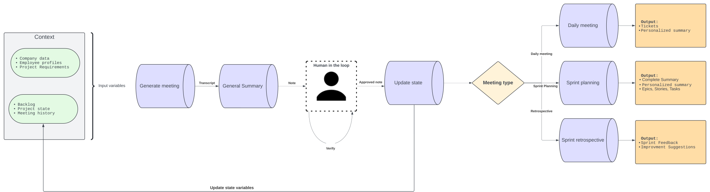

# Thesis Skeleton: AI-Powered Multi-Agent System for Meeting Transcript Processing

## Introduction

In an era of rapid technological advancement, artificial intelligence (AI) has emerged as a transformative force across industries, reshaping how we work, communicate, and make decisions. This thesis presents a novel AI-powered system for analyzing meeting transcripts, a solution that sits at the intersection of recent advancements in AI, changes in work practices, and the growing need for efficient information processing in business environments. By leveraging state-of-the-art language models and carefully designed workflows, this system aims to revolutionize how organizations extract value from their digital meetings, turning unstructured conversations into actionable insights.

### The AI Revolution and Its Catalysts

The field of AI has experienced unprecedented growth in recent years, marked by a clear distinction between traditional AI approaches and the emergence of generative AI. While traditional AI has long been employed in tasks such as data analysis, pattern recognition, and decision support systems, generative AI has opened new frontiers in content creation, language understanding, and problem-solving.

This "AI boom" has been fueled by several key factors:
1. The exponential increase in available data for training AI models
2. Significant advancements in computing power, particularly in specialized hardware
3. Innovations in model architectures, especially the development of transformer models
4. The creation of sophisticated frameworks that facilitate AI development and deployment

These catalysts have converged to enable the development of Large Language Models (LLMs), AI systems capable of understanding and generating human-like text with unprecedented accuracy and fluency. LLMs represent a quantum leap in natural language processing, demonstrating remarkable capabilities in comprehending context, inferring meaning, and even performing complex reasoning tasks.

### The Digital Meeting Revolution

Parallel to these technological advancements, the global business landscape has undergone a significant transformation in how work is conducted. The COVID-19 pandemic acted as a catalyst, forcing organizations worldwide to rapidly adopt remote work practices. As the initial crisis has subsided, many businesses have transitioned to hybrid or fully remote work models, solidifying the central role of digital collaboration tools in modern work life.

This shift has led to an explosion in the number of digital meetings, with platforms like Microsoft Teams, Zoom, and Google Meet becoming integral to daily operations. While these tools have enabled continued collaboration in a distributed work environment, they have also created new challenges. Organizations now grapple with efficiently managing, documenting, and extracting value from the vast amount of information exchanged in these digital meetings.

### Technological Enablers

Two key technological advancements have set the stage for addressing these challenges:

1. **Speech-to-Text Technology**: Recent years have seen remarkable improvements in the accuracy of speech recognition systems. Platforms like Microsoft Teams now offer highly reliable automatic transcription services, providing a solid foundation for further analysis.

2. **Large Language Models**: The development of LLMs has revolutionized natural language understanding and generation. These models, trained on vast amounts of text data using enormous computational resources, have demonstrated an unprecedented ability to comprehend and work with human language.

### AI Systems and Workflows for Business Applications

The availability of these powerful AI tools has led to the development of various frameworks for creating AI-driven systems, such as AutoGen and CrewAI. While these frameworks offer flexibility and power, they often introduce complexity that can be challenging to manage in business environments where reliability and consistency are paramount.

This thesis proposes an alternative approach: the use of controlled workflows with specific, well-defined prompts for each step. This method provides the robustness and predictability required in business applications while still leveraging the power of advanced language models.

### Proposed Solution: AI-Powered Meeting Transcript Analysis System

Building on these technological foundations and guided by the needs of modern businesses, this thesis presents a novel system for analyzing meeting transcripts and generating actionable insights. The system is specifically designed to align with agile software development practices, particularly the Scrum framework, which is widely adopted in the software industry.

By focusing on common Scrum meeting types such as daily stand-ups, sprint planning, and sprint retrospectives, the system addresses the most frequent and critical touchpoints in agile project management. This approach not only provides a clear scope for the research but also ensures that the solution is immediately applicable to a large number of software development teams. The system's modular design allows for easy adaptation to other meeting types and company-specific needs in the future.

This system stands to benefit various stakeholders within an organization:
- **Employees** receive personalized, concise summaries of meetings, ensuring they never miss critical information relevant to their roles.
- **Managers** gain enhanced oversight of project progress and team dynamics, facilitating more informed decision-making.
- **Scrum Masters** can more efficiently track action items, sprint progress, and team performance, enhancing their ability to facilitate the Scrum process.

### Data Generation for System Development and Testing

An important aspect of this research was the need to generate synthetic meeting data for system development and testing. Despite attempts to obtain real-world meeting transcripts, the confidential nature of most business communications made this unfeasible. To overcome this challenge, I developed a sophisticated data generation process that simulates realistic meeting scenarios within the context of an agile software development project.

This simulated dataset includes:
- A fictitious software development team with defined roles and responsibilities
- A series of Scrum meetings (daily stand-ups, sprint planning, retrospectives) over multiple sprints
- Realistic project progression, including the completion of tasks, emergence of challenges, and team dynamics

The data generation process not only provided the necessary input for system development but also offered valuable insights into the complexities of capturing and representing the nuanced interactions that occur in real-world agile teams. This approach ensures that while the system is trained and tested on synthetic data, it is well-prepared to handle the intricacies of actual workplace communications.

Figure 1 provides an overview of the system architecture:

Key features of the proposed system include:
- A modular architecture composed of interconnected workflows, each represented by a blue cylinder in the diagram. Each workflow consists of a sequence of steps executed in a specific order to perform a distinct function within the system.
- Clear delineation of system inputs and outputs for each workflow, allowing for easy tracking of data flow and processing stages.
- A "Human in the loop" component, illustrated in the diagram, which enables human intervention and guidance at any point in the process. This feature ensures that the system can be fine-tuned and directed towards optimal results, combining the efficiency of AI with human expertise and judgment.

### Thesis Structure and Objectives

The subsequent chapters will delve into the technical details of the system, including:
- A comprehensive review of relevant literature and technologies
- Detailed explanation of the system architecture and individual components
- Discussion of the challenges encountered during development and the solutions devised
- Presentation and analysis of system performance and user impact studies
- Exploration of future directions and potential broader applications of the technology

By addressing the growing challenge of information overload in the age of digital meetings, this research contributes to the ongoing dialogue about the role of AI in shaping the future of work. It demonstrates how thoughtfully designed AI systems can enhance human capabilities, improve organizational efficiency, and unlock new value from the wealth of information exchanged in our daily professional interactions.

Before proceeding to the subsequent sections, readers are strongly encouraged to explore the preliminary results and example outputs available in the project's Git repository. These materials provide tangible demonstrations of the system's capabilities and will enhance understanding of the concepts discussed in the following chapters.

# 2. Technical Background and Related Work

## 2.1 Evolution of Natural Language Processing (NLP)

The field of Natural Language Processing (NLP) has its roots in statistical approaches to understanding and generating human language. Early methods focused on representing text as numerical features that could be processed by algorithms. Two fundamental techniques from this era are the Bag of Words model and Term Frequency-Inverse Document Frequency (TF-IDF).

The Bag of Words model [REF] treats a text as an unordered set of words, disregarding grammar and word order but retaining multiplicity. This simple yet effective approach formed the basis for many text classification and information retrieval tasks. TF-IDF [REF], building on this concept, introduced a way to evaluate the importance of a word to a document in a corpus, proving particularly useful in search engines and document clustering.

A significant leap forward came with the introduction of word embeddings, particularly Word2Vec [REF]. This technique uses neural networks to map words to dense vector representations, capturing semantic relationships between words. The ability to represent words as continuous vectors in a high-dimensional space opened up new possibilities for NLP tasks, allowing models to understand context and similarity in ways that were not possible with earlier methods.

The advent of the Transformer architecture [REF] marked a pivotal moment in NLP. The key innovation of Transformers is the attention mechanism, which allows the model to weigh the importance of different parts of the input when producing an output. This solved the long-standing challenge of capturing long-range dependencies in text, a problem that previous architectures like Recurrent Neural Networks (RNNs) struggled with.

Transformers offer several advantages over RNNs:
1. Parallelization: Unlike RNNs, which process input sequentially, Transformers can process all input tokens in parallel, significantly speeding up training and inference.
2. Scalability: The attention mechanism scales better to longer sequences compared to RNNs, which suffer from vanishing gradients over long sequences.
3. Richer context understanding: By allowing each token to attend to all other tokens, Transformers can capture more complex relationships within the text.

The Transformer architecture spawned a series of powerful models that have pushed the boundaries of NLP. Notable examples include:
- BERT (Bidirectional Encoder Representations from Transformers) [REF]: Introduced bidirectional training of Transformers, enabling better understanding of context.
- T5 (Text-to-Text Transfer Transformer) [REF]: Unified various NLP tasks into a text-to-text format, demonstrating impressive performance across a wide range of applications.
- GPT (Generative Pre-trained Transformer) series [REF]: Showed that large-scale language models pre-trained on vast amounts of text data could perform remarkably well on diverse tasks with minimal fine-tuning.

The true revolutionary moment in NLP came with the introduction of Reinforcement Learning from Human Feedback (RLHF) [REF]. This technique, when applied to GPT-3, resulted in ChatGPT (GPT-3.5), marking a significant leap in the quality and usability of language models. RLHF allows models to be fine-tuned based on human preferences, greatly improving their ability to generate helpful, coherent, and contextually appropriate responses.
The impact of RLHF cannot be overstated. It transformed language models from impressive but often unreliable text generators into more controllable, aligned assistants capable of engaging in meaningful dialogue and completing complex tasks. This development paved the way for the widespread adoption of AI chatbots and assistants in various applications.

Another significant advancement in LLM architecture is the Mixture of Experts (MoE) approach [REF]. MoE models use a gating mechanism to selectively activate different "expert" sub-networks for different inputs, allowing for more efficient use of model capacity and improved performance on diverse tasks.

We're also seeing the rise of multimodal LLMs capable of processing and generating not just text, but also images, audio, and even video. Recent developments, such as OpenAI's O1 model [REF], are exploring novel reinforcement learning approaches to further enhance model capabilities and efficiency.

# 2.2 Large Language Models (LLMs)

Modern LLMs typically use variants of the Transformer architecture, with most falling into two categories:
1. Encoder-decoder models (like T5): These are akin to autoencoders, capable of both understanding input (encoding) and generating output (decoding).
2. Decoder-only models (like GPT series, Claude, LLaMA): These are autoregressive models, primarily designed for text generation by predicting the next token in a sequence.

The scale of these models has grown dramatically, pushing the limits of available computing resources. To illustrate this, let's consider some key facts about GPT-4, one of the most advanced LLMs to date [REF]:

- Total parameters: ~1.8 trillion (over 10x more than GPT-3)
- Training compute: Trained on ~25,000 Nvidia A100 GPUs over 90-100 days
- Training data: Trained on a dataset of ~13 trillion tokens

To put this in perspective, let's compare the training process of GPT-4 to the capabilities of Komondor, Hungary's most powerful supercomputer. Komondor boasts 6 PetaFLOPS of computing power and contains 12 A100 GPUs.
While it's not entirely accurate to make a direct comparison (as Komondor lacks the memory capacity to train such a large model), we can estimate the time it would take to match the compute used in GPT-4's training based on FLOPS alone. GPT-4's training on 25,000 A100 GPUs for 90-100 days would be equivalent to running on Komondor's 12 A100 GPUs for approximately 51-57 years.

This comparison underscores the extraordinary scale of modern LLM training. The fact that Meta has access to 600,000 H100 GPUs—each more powerful than an A100—further illustrates the vast chasm between cutting-edge AI research capabilities and even advanced national supercomputing resources.

These enormous computational requirements align with the Chinchilla scaling laws [REF], which suggest that optimal model performance comes from balancing model size with the amount of training data, rather than simply increasing model size alone. As models grow larger, they require proportionally more data and compute to achieve optimal performance.

The capabilities of LLMs have advanced to the point where they can rival human performance on various tasks. One notable benchmark is the Graduate-level Professional Quality (GPQA) [REF], where models are tested on graduate-level exam questions across various disciplines. Recent models have shown performance comparable to or exceeding that of graduate students, a milestone that seemed far-fetched just a decade ago.

State-of-the-art LLMs demonstrate remarkable proficiency in a wide array of tasks, including essay writing, summarization, translation, information retrieval, and API invocation. However, harnessing these capabilities effectively requires understanding how to interact with these models. Large Language Models operate on an autoregressive principle, where each token in a sequence is predicted based on the preceding tokens. This characteristic makes the sequence, or prompt, crucial in guiding the model towards generating desired outputs. Prompt engineering, a relatively new discipline, focuses on developing and optimizing prompts to efficiently use language models for various applications. Key concepts in LLM interaction include defining roles (system, user, assistant), adjusting parameters like temperature (controlling randomness in outputs) and max length, and employing techniques such as planning, few-shot prompts and chain-of-thought prompting. While there are numerous advanced prompting techniques, a full exploration is beyond the scope of this thesis. Understanding these fundamental aspects of LLM interaction is essential for leveraging their capabilities in practical applications, a topic that will be explored further in the implementation section of this work.

## 2.4 Workflows and Frameworks for LLM Applications

### 2.4.1 The Rise of Agentic Workflows and Frameworks

The rapid advancement of Large Language Models (LLMs) has led to the development of various frameworks and workflows designed to harness their capabilities in complex, dynamic environments. These "agentic" frameworks aim to create systems where LLMs can operate with a degree of autonomy, making decisions and taking actions based on their understanding of tasks and contexts.

Several prominent frameworks have emerged in this space:

1. **Autogen**: This framework enables the creation of conversational AI agents that can interact with each other and with humans. Autogen agents can be customized for various tasks and can work collaboratively to solve complex problems [REF].

2. **Crew AI**: This platform allows users to create multiple AI agents with specific roles and responsibilities. These agents can work together on tasks, simulating a team environment with diverse expertise [REF].

3. **LangChain**: This framework provides a structured way to build applications with LLMs. It uses the concept of "chains" to link together different components, including LLMs, for more complex operations [REF].

These frameworks share common characteristics, such as the ability to chain multiple agents or operations together, enabling them to reason about problems and determine subsequent steps in a workflow. For instance, LangChain can use an LLM to decide on a sequence of actions based on the current state and goal of a task.

The potential of these agentic frameworks is particularly evident in scenarios requiring high adaptability or creative problem-solving. They have shown promise in research contexts, complex decision-making processes, and tasks that benefit from diverse perspectives or expertise.

### 2.4.2 Limitations of Agentic Frameworks in Business Contexts

Despite their potential, agentic frameworks often present challenges when applied to typical business processes:

1. **Complexity vs. Business Needs**: Many business processes require clear, predictable workflows rather than the dynamic, sometimes unpredictable nature of agentic systems. The complexity of these frameworks can be overkill for straightforward tasks, leading to over-engineered solutions.

2. **Consistency and Predictability**: The dynamic decision-making inherent in agentic frameworks can lead to variability in outputs. This lack of consistency can be problematic in business contexts where reproducibility and predictability are crucial.

3. **Resource Intensiveness**: Agentic workflows typically require more computational resources and generate higher token usage, potentially increasing operational costs.

### 2.4.3 Structured and Controlled Workflows: A Practical Alternative

Given these limitations, a more structured and controlled approach to LLM workflows often proves more suitable for typical business applications. This approach involves designing predefined sequences of operations with clear input and output specifications for each step.

Key characteristics of structured workflows include:

1. **Predictability**: By following a predetermined sequence of steps, structured workflows offer more consistent and predictable outcomes.

2. **Ease of Implementation and Maintenance**: These workflows align better with traditional software development practices, reducing complexity in system design and making maintenance more straightforward.

3. **Integration with Existing Systems**: Structured workflows can be more easily integrated with existing business logic and systems, minimizing disruption to established processes.

4. **Controlled LLM Interactions**: Rather than relying on LLMs for end-to-end processing, structured workflows use them for specific, well-defined tasks within a larger process. This approach allows for more precise control over LLM inputs and outputs.

5. **Efficiency**: By clearly defining the role of LLMs within the workflow, structured approaches can optimize token usage and computational resources.

In a structured workflow, LLMs can be effectively used for tasks such as:
- Text analysis and categorization
- Guided content generation
- Information extraction from unstructured data

These tasks are performed within a controlled environment, with clear guidelines and constraints, ensuring that the LLM's capabilities are leveraged efficiently and reliably.

Successful implementations of structured LLM workflows can be found in various business applications, including customer service automation, document processing and summarization, and assisted decision-making in predefined scenarios.

By adopting a structured approach, businesses can harness the power of LLMs while maintaining the predictability, efficiency, and control necessary for their operations. This method strikes a balance between leveraging advanced AI capabilities and meeting the practical needs of business environments.

---

### 2.4 Multi-Agent AI Systems
- Theoretical foundations of multi-agent systems
- Applications in task decomposition and problem-solving
- Coordination and communication between agents

### 2.5 Agentic Workflows in Natural Language Processing
- Definition and components of agentic workflows
- Key paradigms: reflection, tool use, planning, and collaboration
- Examples of agentic workflows in NLP tasks

### 2.6 Meeting Summarization Techniques
- Overview of existing approaches to meeting summarization
- Extractive vs. abstractive summarization methods
- Challenges in meeting transcript processing (e.g., speaker diarization, topic segmentation)

### 2.7 Personalization in AI-generated Content
- Techniques for tailoring AI outputs to individual users
- Challenges in maintaining coherence while personalizing content
- Ethical considerations in AI personalization

### 2.8 Visual Information Generation from Text
- Methods for automatic diagram and chart generation
- Integration of visual elements in text summarization
- Tools and libraries for programmatic visualization (e.g., Mermaid)

### 2.9 Frameworks for LLM-based Applications
- Overview of LangChain and LangGraph
- Comparison with other frameworks for LLM application development
- Best practices in designing LLM-powered applications

DEPRECATED:

# 2.3 Interacting with Large Language Models

Large Language Models (LLMs) operate on an autoregressive principle, where each token in a sequence is predicted based on the preceding tokens. This characteristic makes the initial sequence, or prompt, crucial in guiding the model towards generating desired outputs. Understanding how to effectively interact with LLMs is essential for leveraging their capabilities in various applications.

### Prompt Engineering

Prompt engineering is a discipline focused on optimizing the initial sequences provided to LLMs to achieve desired outcomes. Several techniques have been developed to enhance LLM performance:

1. **Zero-shot prompting**: This technique involves asking the model to perform a task without providing specific examples, relying on its pre-trained knowledge.

2. **Few-shot prompts**: By providing a few examples within the prompt, this method enables in-context learning, allowing the model to understand and mimic the desired output format or style.

3. **Chain of thought prompting**: This approach encourages the model to break down complex problems into intermediate steps, often improving performance on reasoning tasks [REF].

4. **Reflexion**: A technique where the model is prompted to reflect on its own outputs, potentially leading to self-improvement or error correction [REF].

### Key Parameters

Several parameters can be adjusted to fine-tune LLM outputs:

- **Temperature**: Controls the randomness of outputs. Lower values lead to more deterministic responses, while higher values encourage diversity.
- **Top P (nucleus sampling)**: Another method to control output determinism, focusing on the most probable tokens.
- **Max Length**: Limits the number of tokens generated, helping to control response size and relevance.
- **Stop Sequences**: Specific strings that halt token generation, useful for controlling response structure.
- **Frequency and Presence Penalties**: These parameters discourage repetition in the model's outputs.

It's generally recommended to adjust either temperature or Top P, and either frequency or presence penalty, but not both pairs simultaneously.

### Roles in LLM Interaction

Defining clear roles is crucial for effective LLM interaction:

- **System role**: Sets the overall behavior and capabilities of the model.
- **User role**: Represents the human interacting with the model.
- **Assistant role**: Defines how the model should respond and interact.

Accurate role definition and instructions are vital for achieving desired outcomes, especially in single-turn interactions.

### Context Windows

The context window represents the amount of text an LLM can consider at once. Modern models can handle substantial context windows (e.g., 200,000 tokens, equivalent to roughly 500 pages of text), significantly impacting their ability to maintain coherence and relevance over extended interactions.

### Challenges

A notable challenge in LLM interaction is the "blank page" problem, particularly relevant to single-turn prompts. This occurs when the model lacks sufficient context to generate a relevant or coherent response. Overcoming this challenge often requires providing detailed instructions and relevant context about the overall state within each interaction.

The effective use of these techniques and understanding of LLM behavior are crucial for developing robust applications and workflows that leverage the power of large language models. As the field continues to evolve, new methods and best practices for LLM interaction are likely to emerge, further enhancing our ability to utilize these powerful tools.

